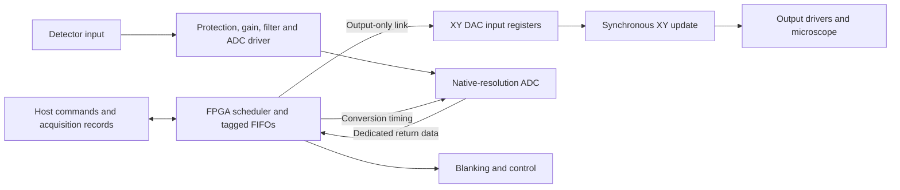

# Architecture and pixel association — draft

ADC and DAC data travel on independent nets. Dedicated serial links can also
meet this requirement; a wider ADC does not necessarily need 24 parallel pins.
The carrier and digital interface will be selected together. No OE arbitration
exists between ADC and DAC. Fixed-direction buffering or level translation may
still be needed. An external capture register is optional and must be justified
by the timing budget, not removed solely because the old register had OE pins.

## Pixel timing contract

For a triggered converter, the conceptual sequence for pixel p is:

1. Accept the XY command and allocate `(frame_id, pixel_id)`.
2. Load both DAC input registers; perform a defined paired update at time t0.
3. Account for DAC/output settling, scan-system response and detector delay.
4. Trigger the conversion aperture(s) assigned to this pixel.
5. Carry the pixel ID and sample index through the known conversion/readout
   latency. Associate the returned word with its aperture, not its arrival time.
6. Average only valid samples tagged for this pixel; return the result with
   sample count and flags. Retain raw samples when requested.

For a continuously clocked pipeline ADC, use the same principle with a defined
aperture schedule and a tag pipeline matched to converter latency. Do not stop
its clock arbitrarily or assume BUSY/DRDY exists on every converter. Any digital
filter, decimation, restart transient or group delay belongs in the timing model.
Do not inherit the previous controller's eight-cycle latency without measurement.

A simple step-and-settle mode should be validated first. Overlapping acquisition
and DAC preparation can be added while retaining identical tag semantics.
In continuous scanning, detector/scan response can smear adjacent pixels even
when digital tags are correct; measure and model this separately.

## Backpressure and fault behavior

- Buffer data and tags together; never advance one without the other.
- At capacity, pause at a defined safe pixel boundary if the converter and scan
  mode permit it. For uninterrupted conversion, report discarded samples and
  mark affected pixels invalid; never silently shift subsequent pixel indices.
- On abort/reset, terminate the frame explicitly, discard stale pipeline tags,
  and apply the specified blanking/output state.
- Per-sample tags may remain internal; host frame/block metadata can encode
  contiguous pixel ranges. Budget the actual wire representation before choosing
  a controller. This document does not freeze a packet format.

## Pin and timing budget

The Glasgow revC3 expansion connector has 26 signal pins. Parallel 16–24-bit
ADC data plus one 14-bit DAC output bus needs 30–38 data pins before clocks and
controls; independent 14-bit X and Y buses need 44–52 data pins. These are
illustrations retaining old DAC widths, not a selected new interface.

Using A/B pins changes the electrical route and competes with beam-control
assignments. A serial/multilane link or a local FPGA can reduce connector pin
pressure, but adds interface-clock and transport requirements. Complete the
pin, bank-voltage, clock and bandwidth budgets before freezing the schematic.

Source: [Glasgow revC3 connector documentation](https://glasgow-embedded.org/en/revisions/revC3.html#lvds-connector).
