# New scan subtarget design baseline

Status: Rev-A design baseline. Component family and board topology are aligned
to the supplied Open Beam Interface Rev-A4 source. This package is not yet a
signed fabrication release.

## Scope and interfaces

Support detector acquisition and two synchronous X/Y scan outputs under the
Glasgow Operations platform. Keep motion-control hardware outside this design.
The existing FPGA uses 14-bit scan coordinates and a 16-bit output stream.
Retain application-level coordinate semantics where practical, but version the
new physical interface and its sample/status representation explicitly.

Selected architecture using the already implemented Glasgow gateware:

```mermaid
flowchart LR
    D[Detector connector] --> P[Protection and defined input impedance]
    P --> A[Gain / offset / anti-alias filter / ADC driver]
    A --> C[ADC and reference]
    C -->|Shared 14-bit ADC/DAC bus| G[Glasgow capture and pixel sequencer]
    G -->|Shared 14-bit bus and strobes| X[Synchronous X/Y DAC]
    X --> O[Output amplifiers and protection]
    O --> M[Microscope scan input]
```

## Requirements that must be resolved

| Requirement | Available evidence | Needed for the new board |
| --- | --- | --- |
| Detector input | One scope image spans about -0.18 to +0.35 V | Required normal and maximum voltage range, source impedance, DC coupling, termination and useful bandwidth |
| X/Y outputs | Old schematic offers multiple gain/offset settings | Required minimum/maximum voltage, single-ended or differential, load resistance/capacitance and cable length |
| Rates | Current nominal ADC clock is 4 MHz | Minimum raw ADC rate, scan update rate and worst-case settling accuracy/time |
| Resolution | Existing scan coordinates are 14 bits | Required effective resolution/noise, not merely converter bit count |
| FPGA interface | Existing bus shares 14 data lines plus six strobes | Retain existing Glasgow rev-C3 pin assignment and polarity |
| Power | Old board accepts +5 V and +/-15 V | Available rails, tolerances and current budget at the installation |
| Mechanics | Existing reference connector geometry | Direct Glasgow mounting or cable connection; any fixed enclosure/connector constraints |
| Beam control | Existing subtarget also drives external-control/blanking ports | Whether these remain on the existing wiring; electrical polarity and power-up state if included on this PCB |

No load-driving amplifier or protection network should be selected from the
scope image alone. A 50-ohm terminated input and a high-impedance input can
produce materially different detector readings. Likewise, +/-10 V into 50 ohms
requires 200 mA peak, unlike a high-impedance microscope input. These are
illustrations of the unresolved contract, not assumed requirements.

## Acquisition design decisions

1. Retain the selected reference LTC2246H parallel ADC and its reference,
   differential-driver, clamp, clock, and output-register peripherals. The ADC
   runs on the existing 14-bit shared path; ADC overflow remains a separately
   routed diagnostic/test signal because the existing applet payload is 14 bits.
2. Provide a known-source input path or documented jumper fixture for ground,
   calibrated midscale, and near-full-scale measurements. Calibration-source
   impedance and settling must be included in the ADC drive calculation.
3. Preserve the current 14-bit sample format for applet compatibility. Bring
   overflow, bus ownership, ADC OE, DAC OE, and latch strobes to test points so
   a full-scale capture can be distinguished from a bus/control fault during
   bring-up.
4. Derive ADC differential full scale, common mode, driver swing, reference
   loading, RC settling and anti-alias response for the confirmed detector
   range. Include amplifier input limits under startup and overload.
5. Add test points with nearby ground access at analog stage boundaries,
   reference, supplies and the ADC interface. Keep added probe capacitance
   outside the sensitive sampling node where practical.

The serial AD7380 alternative is rejected for this revision because it would
break the implemented shared parallel bus and require a new gateware transport.
The selected reference device is LTC2246H, a 14-bit 25 MSPS LQFP ADC with a
separate logic-output supply and a 1 to 2 Vpp differential input range.
[Manufacturer documentation](https://www.analog.com/en/products/ltc2246h.html).

## Throughput and timing constraints

The current rev-C platform runs its synchronous domain at 48 MHz. The existing
parallel ADC bus avoids the serial-throughput limit that would apply to a new
SPI converter. The current configuration's `adcHalfPeriod=6` yields a nominal
4 MHz ADC clock, within the LTC2246H minimum operating rate and below its
25 MSPS maximum.

At each pixel, the FPGA owns the bus for the ADC read, releases it for one full
turnaround cycle, then writes the X and Y DAC codes on the same shared 14-bit
bus. The ADC code accepted for a pixel is delayed through the existing applet
pipeline (`adcLatency`, currently 8) and is associated with the DAC coordinate
that initiated that conversion. This is a pipeline delay, not an analog settling
guarantee.

If a faster I/O clock is used, close timing on the actual iCE40 build and
connector/cable path. Budget converter clock-to-output, PCB/cable propagation,
FPGA setup/hold, skew and jitter. Clock-domain crossings require an explicit
handshake/FIFO design; passing a multi-bit sample through independent
synchronizers is not sufficient.

ADC acquisition rate, DAC update rate, accepted scan point rate, averaged pixel
rate and USB throughput are distinct. Include analog settling, detector delay,
conversion delay and pipeline tagging in coordinate-to-sample alignment. Do
not reuse the old eight-cycle latency merely because the old JSON contains it.

## DAC and output path

Retain the two AD9744 DACs, the two THS4151 differential output drivers, and
the existing gain/offset/output connector peripherals. The FPGA writes X and Y
sequentially on the shared bus; each DAC has its own latch strobe and the pair
forms one pixel update. World calibration is a host/system mapping from logical
code to measured X/Y output and microscope position. Store scale, offset,
polarity, rotation, and axis-cross-coupling terms in calibration data; do not
alter the FPGA code contract.

The calibration fixtures must expose zero, midscale, and endpoint codes at the
output connectors. The existing adjustable gain/offset components remain in the
BOM, but their final settings must be recorded per assembled board.

## Power, layout and manufacturing development

Use a deliberate ground/return scheme and placement that separates sensitive
analog currents from digital and DAC output currents. Avoid signal routes across
reference-plane gaps. Locate protection at connectors and decoupling at supply
pins. Derive layer stackup, impedance targets and spacing from selected parts,
interfaces and the fabricator's process rather than copying old copper geometry.

Treat the Glasgow expansion pins as direct FPGA-bank connections, not the
protected adjustable A/B port buffers. Verify connector orientation, bank voltage
and power sequencing against Glasgow hardware before assigning the new pinout.
Avoid back-powering either board through signal or supply pins.

The initial handoff target is a manufacturable engineering prototype. Required
steps after requirements closure are complete schematic/MPN selection, footprint
verification, analog/timing checks, layout/routing, ERC/DRC and netlist agreement,
and manufacturing export verification. KiCad CLI was not found on PATH in the
current environment; provision a compatible toolchain before claiming those
checks or generating verified exports.

## Bring-up acceptance plan

1. With outputs disconnected from the microscope, inspect assembly and measure
   supply rails/reference/idle output state under current-limited power.
2. Exercise ADC diagnostics and configuration readback where supported. Confirm
   bit order, coding, full-width capture, overflow and lost-sample reporting.
3. Inject calibrated DC values across the agreed input span; compare raw codes
   and status with expected conversion. Set numeric gain/offset/noise limits
   from the completed error budget, not arbitrary thresholds.
4. Inject a known varying signal and measure noise, bandwidth and clipping.
   Repeat with DAC activity enabled to measure coupling into acquisition.
5. Measure X/Y output endpoints, paired-update skew, load stability and settling
   at the agreed worst-case step/rate. Correlate captured samples to updates.
6. Verify reset, USB disconnect, missing clocks and power sequencing produce
   the defined output/blanking behavior. Then validate raster/vector operation.

These are planned checks. No board measurements, hardware validation, ERC/DRC,
or manufacturing acceptance have been performed for this new design.
