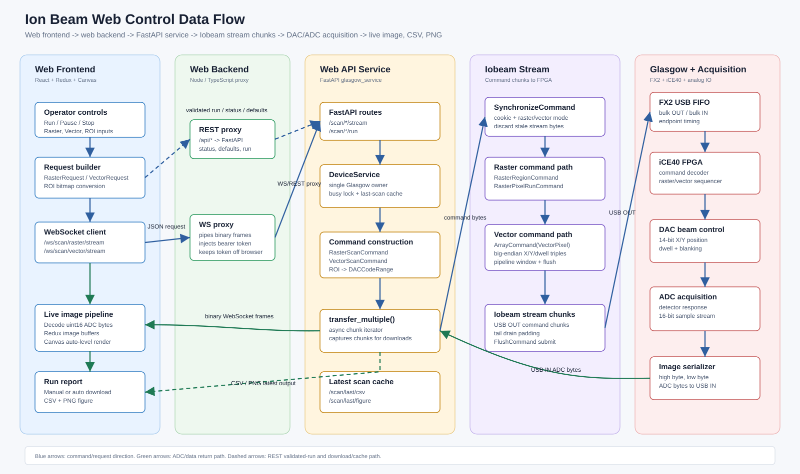
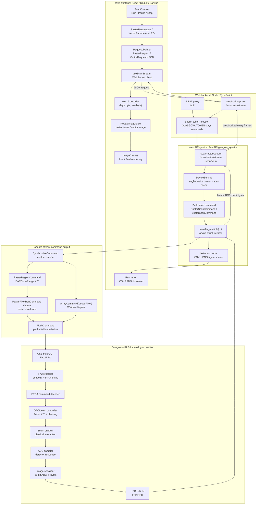

# Ion Beam Technology — Web Control Panel

A browser-based control surface for the Ion Beam Technology Ltd. Glasgow-based
beam control system. Wraps the existing `glasgow_service` FastAPI process with
a Node.js/TypeScript proxy and a React + Redux + TypeScript front-end.

---

## What this gives you

* **Run / Pause / Stop** raster and vector scans from a browser.
* **Parameter forms** for resolution, dwell, latency, frame-blank, output mode,
  pre-process, custom vector points — exactly the fields the FastAPI
  `RasterRequest` / `VectorRequest` Pydantic models accept.
* **Live image** on a canvas that renders raster pixels as the chunks stream
  in over a WebSocket. Vector mode plots received points.
* **Validation report** and **CSV path** echoed back from the blocking REST
  endpoints so you keep the wet-run validation behaviour the existing pytest
  suite uses.
* **Status bar** wired to `GET /status` (state, scans completed, chunks in
  flight).
* **Mock mode** on the Node proxy (`MOCK=1`) — runs the whole UI without a
  Glasgow attached, so this can be demoed and integration-tested separately
  from hardware.

## Layout

```
ionbeam-web/
├── README.md                 ← you are here
├── glasgow_service/          ← (your existing FastAPI service, unmodified)
│
├── backend/                  ← Node 20+ / TypeScript / Express + ws
│   ├── package.json
│   ├── tsconfig.json
│   ├── .env.example
│   └── src/
│       ├── server.ts         ← entry point
│       ├── config.ts         ← env loader (PROXY_TARGET, MOCK, GLASGOW_TOKEN)
│       ├── restProxy.ts      ← /api/* → FastAPI
│       ├── wsProxy.ts        ← /ws/scan/{raster,vector}/stream → FastAPI
│       └── mockHardware.ts   ← synthetic raster/vector chunks for demos
│
└── frontend/                 ← React 18 / Redux Toolkit / TS / Vite
    ├── package.json
    ├── vite.config.ts
    ├── tsconfig.json
    ├── index.html
    └── src/
        ├── main.tsx
        ├── App.tsx
        ├── store/            ← RTK store + slices + RTK Query
        ├── components/       ← ScanControls, ImageCanvas, etc.
        ├── types/            ← shared TS types matching Pydantic models
        └── styles/           ← Ion Beam Tech-themed CSS
```

## Running everything

You need three processes in dev. Each has its own README; here is the
quick path.

```powershell
# 1) Glasgow FastAPI service (your existing project) — port 8765
$env:GLASGOW_CONFIG="C:\Project\IobeamTech\Development\GlasgowDataIO\Json\streamData.json"

# Optional: turn on bearer auth
# $env:GLASGOW_TOKEN="replace-me-with-32-bytes-of-hex"
..\.venv\Scripts\python.exe -m uvicorn glasgow_service.api:app --host 127.0.0.1 --port 8765 --ws websockets

# 2) Node proxy / static server — port 4000
cd backend
npm install
Copy-Item .env.example .env   # edit if your token / port differ
npm run dev

# 3) React dev server — port 5173, proxies /api and /ws to localhost:4000
cd ../frontend
npm install
npm run dev
```

Open <http://localhost:5173>.

### Without hardware (demo / CI)

```powershell
cd backend
$env:MOCK="1"; npm run dev    # backend invents raster + vector chunks
cd ../frontend
npm run dev
```

The UI behaves identically — useful when bringing up new clients or
demonstrating the workflow.

### Production build

```bash
cd frontend && npm run build  # emits frontend/dist/
cd ../backend && npm run build && npm start
```

The Node server then serves `frontend/dist/` and proxies `/api` + `/ws` to
the FastAPI process. Put it behind nginx/Caddy for TLS.

### Deployment workflow

The existing JSON-driven deploy workflow lives in
[DeployWorkSpace/Development/DistributionDeploy](/home/vboxuser/Project/IobeamTech/Development/DeployWorkSpace/Development/DistributionDeploy).
Ionbeam-web exposes convenience npm scripts that delegate to that workflow for
both local and production runs:

```bash
cd backend
npm run deploy:local
npm run deploy:production
npm run deploy:mobility
```

The workflow JSON now switches to production mode with:

* backend build/start instead of `npm run dev`
* the frontend launcher disabled in production
* the UI browser target set to `https://ionbeamtech.com/control`

The mobility-only path adds:

* `--mobility` deploy flag
* the mobile shell rendered at `/mobility`
* verification / launch URLs switched to the mobility route
* an `Allowed Hosts` admin tab that persists the Vite dev-server allowlist in `iobeam_admin.hosts` and regenerates `frontend/src/generated/allowedHosts.ts`

### Local mobility verification

You can verify the mobility surface locally without pushing to a remote host:

1. Start the backend in mobility mode:

   ```bash
   cd backend
   npm run dev:mobility
   ```

2. Start the frontend mobility shell:

   ```bash
   cd frontend
   npm run dev:mobility
   ```

3. Open `http://127.0.0.1:5173/mobility`.

If you want the desktop app and the mobility app side by side, keep the
normal frontend dev server running and use the `/mobility` route directly.
The browser can now mount the mobility shell on any `/mobility*` path without
redirecting back to `/control`.

For the remote VM, see the concrete nginx/systemd guide in
[deploy/remote-vm.md](/home/vboxuser/Project/IobeamTech/Development/ionbeam-web/deploy/remote-vm.md).

Production mode is controlled by the workflow JSON's `Deployment.IsProduction`
flag and the `--production` CLI switch on `distributionDeployApp.py`.

## Why this shape

* The browser **never sees `GLASGOW_TOKEN`**. The Node proxy injects the
  `Authorization: Bearer …` header server-side. This is the same posture the
  `examples/raster_custom.py` REST client takes — token in env, never in URL.
* The Node proxy lets you keep the FastAPI service bound to `127.0.0.1` and
  expose only the web app on the public interface.
* Mock mode lives at the proxy layer (not in the React app) so the front-end
  has exactly one code path, and the mock honours the same WebSocket message
  format (`{event:"done", chunks:N}`) the real service emits.

## Wiring summary

| User action            | Frontend                          | Backend (Node)                    | Glasgow service                       |
| ---------------------- | --------------------------------- | --------------------------------- | ------------------------------------- |
| Page load              | `GET /api/status`, `/api/defaults`| Forwards                          | `GET /status`, `/defaults`            |
| Run raster (live)      | open `ws://…/ws/scan/raster/stream` | Pipes WS to upstream            | `WS /scan/raster/stream`              |
| Run raster (validated) | `POST /api/scan/raster/run`       | Forwards with bearer              | `POST /scan/raster/run` → `ScanResult`|
| Pause                  | `ws.close(1000)`                  | Drops upstream socket             | `WebSocketDisconnect` → cancels gen   |
| Stop                   | `ws.close(1000)` + clear state    | same                              | same                                  |

## Scan Physics Principle

The control panel drives a focused charged-particle beam across a device under
test by commanding two analog deflection axes and sampling the detector signal
after each commanded beam position. The implementation treats the beam as a
sampled measurement probe:

1. **DAC X/Y codes set beam position.** The FPGA emits two 14-bit DAC codes,
   one for X deflection and one for Y deflection. The downstream analog
   electronics translate those codes into beam deflection voltages.
2. **Dwell gives the sample time.** Each pixel or point includes a dwell value.
   Longer dwell lets the physical beam and detector integrate for more clock
   cycles, improving signal stability at the cost of scan time.
3. **ADC returns the measured response.** After the commanded position/dwell,
   the detector path is sampled and serialized back as a 16-bit ADC value. The
   UI auto-levels the raw ADC range for display; the CSV preserves raw integer
   samples.
4. **Image intensity is detector response, not generated color.** Dark/bright
   pixels in the live canvas represent relative ADC magnitude at each beam
   location. The canvas display is a visualization of the sample stream; it is
   not part of the hardware feedback loop.

### Raster Scan

Raster scan is a rectangular grid sweep. The host sends a `RasterRegionCommand`
with X/Y `DACCodeRange` values, then sends repeated `RasterPixelRunCommand`
chunks. The FPGA's raster scanner advances through the configured region in
row-major order. For each raster pixel:

```text
pixel index -> (row, col) -> (DAC X, DAC Y) -> dwell -> ADC sample
```

The current frontend stores the returned samples in a flat `Uint16Array` and
renders them row-major into a square canvas. A partial ROI raster scan uses the
same raster algorithm, but `DeviceService._build_raster_cmd()` converts the ROI
bounds into smaller X/Y `DACCodeRange` values so the full requested resolution
is spent inside that subregion.

### Vector Scan

Vector scan is an explicit point list. The host sends `VectorPixelCommand`
payloads in the order points should be visited. The default vector pattern is
still a grid, but it is represented as a stream of `(x, y, dwell)` triples
instead of a raster-region plus run length. Custom vector scans can visit any
sequence of points and can revisit points.

```text
point list[i] = (DAC X, DAC Y, dwell) -> beam move -> ADC sample[i]
```

The frontend reconstructs the image by mapping each returned ADC sample back to
the point index that generated it. For the default pattern, sample `i` maps to
`col = floor(i / edge)` and `row = i % edge`, matching
`glasgow_service._roi_vector_iter()` and `macros.vector.default_iter()`.

Raster is the best fit for dense rectangular images. Vector is the best fit for
custom trajectories, ROI-derived bitmap scans, sparse points, or patterns where
the beam should not visit every pixel in a simple row-major order.

## Software Workflow

The web stack is split into three layers: React UI, Node proxy, and Python
Glasgow service. The browser never talks directly to the device process.

```mermaid
flowchart LR
    Operator[Operator] --> UI[React + Redux UI]
    UI -->|GET /api/status, /api/defaults| Node[Node proxy]
    UI -->|POST /api/scan/*/run| Node
    UI -->|WS /ws/scan/*/stream| Node
    Node -->|REST/WS + bearer token| API[FastAPI glasgow_service]
    API --> DeviceService[DeviceService]
    DeviceService --> Command[RasterScanCommand or VectorScanCommand]
    Command --> Conn[Glasgow Connection.transfer_multiple]
    Conn --> Stream[GlasgowStream / USB stream]
    Stream --> FX2[Glasgow FX2 USB FIFO]
    FX2 --> FPGA[iCE40 FPGA gateware]
    FPGA --> Analog[DAC outputs + ADC input]
    Analog --> FPGA
    FPGA --> FX2
    FX2 --> Stream
    Stream --> Conn
    Conn --> API
    API -->|binary chunks or ScanResult| Node
    Node --> UI
    UI --> Canvas[Live canvas + CSV/PNG downloads]
```



### Live Stream Path

```mermaid
sequenceDiagram
    participant UI as React UI
    participant Node as Node proxy
    participant API as FastAPI
    participant Svc as DeviceService
    participant Dev as Glasgow device

    UI->>Node: WebSocket /ws/scan/raster/stream or /vector/stream
    Node->>API: Upstream WebSocket
    UI->>Node: JSON RasterRequest or VectorRequest
    Node->>API: Forward request
    API->>Svc: raster_scan(req) or vector_scan(req)
    Svc->>Dev: transfer_multiple(command, latency)
    loop chunks
        Dev-->>Svc: ADC samples
        Svc-->>API: binary wire bytes
        API-->>Node: binary WebSocket frame
        Node-->>UI: binary WebSocket frame
        UI->>UI: decode uint16 + append image buffer
    end
    API-->>UI: {"event":"done","chunks":N}
    UI->>UI: phase=completed; render final canvas
```

### End-to-End Data Flow

This diagram shows the concrete scan data path from the browser control panel
to Iobeam stream chunk output and ADC acquisition, then back to the live canvas
and downloadable outputs.

For a Visio/LibreOffice-Draw style editable diagram, open
[`docs/ionbeam-data-flow.svg`](docs/ionbeam-data-flow.svg). The SVG can be
viewed in a browser and imported into LibreOffice Draw, Inkscape, or Visio-like
diagram tools.





### Validated Run Path

`Run validated` uses the blocking REST endpoints. The service runs the same
hardware command to completion, stores the latest scan cache for downloads, and
returns a `ScanResult` with timing and validation checks. CSV and PNG are then
pulled on demand from `/scan/last/csv` and `/scan/last/figure`.

## DAC/ADC Algorithms and Glasgow Implementation

### Coordinate Model

The low-level hardware coordinate space is DAC code space:

| Quantity | Meaning |
| --- | --- |
| DAC X/Y | 14-bit position code, valid `0..16383`. |
| Dwell | Unsigned command value. In low-level delay units, one delay unit is one 48 MHz clock cycle. |
| ADC sample | 16-bit detector sample returned by the FPGA data path. |
| Latency | Host-side chunking target used to decide how many pixels/points are grouped per transfer chunk. |

The web UI keeps ROI editor coordinates separate from DAC code space. A drawn
ROI is only sent as a hardware ROI when there is a real bitmap source to map
from, either a loaded image or a previous scan render promoted into the ROI
image source. This avoids accidentally sending a default UI rectangle such as
`0..100` as a tiny DAC-space scan near zero.

### Raster Algorithm

`DeviceService._build_raster_cmd()` builds a `RasterScanCommand`:

1. If no ROI exists, create `DACCodeRange.from_resolution(resolution)` for X
   and Y.
2. If ROI exists, sort its endpoints and build DAC ranges with
   `_dac_range_for_bounds(start, end, count)`.
3. Send `SynchronizeCommand(cookie, raster=True, output=SixteenBit)`.
4. Send `RasterRegionCommand(x_range, y_range)`.
5. Send one or more `RasterPixelRunCommand` chunks. Each run encodes a dwell
   value and repeat length, so raster command traffic is compact.
6. Read `pixel_count * 2` bytes per chunk in 16-bit mode.
7. Append returned samples to the frontend frame buffer in raster order.

The chunk iterator groups pixels by accumulated dwell against `latency`. The
sender and receiver run concurrently with token-based pacing. Raster currently
allows a deeper host pipeline than vector because each raster chunk command is
small: the device already knows the region and only needs run lengths.

### Vector Algorithm

`DeviceService._build_vector_cmd()` builds a `VectorScanCommand`:

1. Choose an iterator of `(x, y, dwell)` points:
   - default full sweep: `_roi_vector_iter(vector_resolution, roi)`
   - custom points: the request's `points`
   - simulation ROI fallback: generated ROI sweep when hardware ignores the
     simulation bitmap
2. Optionally call `_pre_process_chunks(latency)` so the vector command stream
   is packed before USB transfer begins.
3. Send `SynchronizeCommand(cookie, raster=False, output=...)`.
4. Pack point chunks using `ArrayCommand(cmdtype=VectorPixel)` followed by
   big-endian `x, y, dwell` triples.
5. Write and flush each chunk, then read exactly the ADC sample count expected
   for that chunk.

Vector chunks are much larger than raster chunks because every point carries
explicit coordinates. For that reason `VectorScanCommand` uses a smaller
pipeline window (`MAX_PIPELINE = 4`) and explicit per-chunk flushes. This keeps
host OUT buffering aligned with device-visible progress.

### ADC Wire Format and Frontend Decode

The FPGA image serializer emits each 16-bit ADC sample as high byte then low
byte. The frontend reconstructs samples with:

```text
sample = (high_byte << 8) | low_byte
```

Raster samples are appended directly to `image.frame`. Vector samples are
appended through `appendVectorSamples()`, which paints into `vectorImage`
according to the active vector pattern:

| Pattern | Mapping |
| --- | --- |
| default | `col = floor(i / edge)`, `row = i % edge`, `image[row * edge + col] = sample` |
| custom | use precomputed render-space point coordinates from `setupVector()` |

The display path auto-scales the populated raw ADC range to grayscale. CSV
export preserves the raw 16-bit values.

### Glasgow Device Architecture

The physical data path is:

```text
Host Python command stream
  -> Glasgow connection/demultiplexer
  -> USB bulk OUT
  -> Cypress FX2 synchronous FIFO bus
  -> iCE40 FPGA command decoder
  -> beam/DAC controller
  -> analog beam deflection + detector
  -> ADC sampler
  -> FPGA image serializer
  -> FX2 synchronous FIFO IN
  -> USB bulk IN
  -> Python chunk iterator
  -> FastAPI/WS
  -> browser canvas
```

The repository uses Glasgow's Amaranth-based gateware stack. The FX2 bus layer
is handled by the Glasgow gateware crossbar, which exposes stream-like FPGA
interfaces while managing the FX2 FIFO timing, endpoint selection, packet
boundaries, and synchronous FIFO hazards. The higher-level Iobeam gateware then
consumes command bytes and produces ADC sample bytes.

### FX2 Bus Control

Glasgow's FX2 path is FIFO-oriented rather than register-oriented. The host
writes command bytes to an OUT endpoint and reads sample bytes from an IN
endpoint. The FX2 crossbar in the Glasgow gateware coordinates:

- endpoint selection for OUT and IN FIFOs
- FIFO ready/full/empty signaling
- host packet boundaries
- synchronous FIFO timing between the FX2 and iCE40
- buffering so FPGA modules see stream interfaces instead of raw FX2 control
  strobes

`FlushCommand` is important because it forces pending FPGA-side data to be
submitted over USB even if a FIFO packet is not naturally full. The scan macros
flush at synchronization boundaries, per chunk, and at the tail of the scan to
keep host/device state aligned.

### Stream Synchronization

Every transfer begins with a synchronization handshake:

1. Host sends `SynchronizeCommand(cookie, raster=..., output=...)`.
2. FPGA returns a synchronization marker containing `0xffff` and the cookie.
3. Host reads until that marker before treating later bytes as scan samples.

This prevents stale bytes from a previous scan from being interpreted as the
first samples of the next scan. The connection object also has a broader
`_synchronize()` method used before arbitrary transfers; individual scan macros
perform scan-mode synchronization again so the FPGA decoder is in the correct
raster/vector output mode.

### Pipeline Drain and Tail Synchronization

The FPGA pipeline contains multiple buffered stages. Near the end of a scan,
the last real ADC samples can remain inside the Supersampler, BusController, or
loopback/serializer path until additional pixel commands push them forward. To
avoid blocking forever on the final read:

- raster sends padding `VectorPixelCommand` traffic after the real raster runs
- vector sends an `ArrayCommand(VectorPixel)` drain tail sized by
  `_drain_floor_pixels` and scan size
- the receiver only reads the expected real sample count; drain samples remain
  unread and are discarded during cleanup

This is why vector has explicit drain constants and waits for the sender task
to finish its final flush. If the bitstream or pipeline depth changes, those
drain constants must be revalidated.

### Toolchains

The implementation spans several toolchains:

| Layer | Toolchain |
| --- | --- |
| FPGA/gateware | Glasgow + Amaranth/nMigen-style Python gateware, built for the iCE40 target |
| Device transport | Glasgow Python stack, Cypress FX2 USB bulk/FIFO transport |
| Hardware service | Python 3, FastAPI, Pydantic, asyncio |
| Web proxy | Node.js 20+, TypeScript, Express, `ws` |
| Frontend | React 18, Redux Toolkit, TypeScript, Vite |
| Validation/export | Python service cache for server CSV/PNG; frontend client-side CSV fallback for live streams |

The web app intentionally keeps hardware-specific command construction in
`glasgow_service` and `GlasgowDataIO`. The frontend owns operator workflow,
request shaping, live decode, ROI image handling, and display/export controls.
